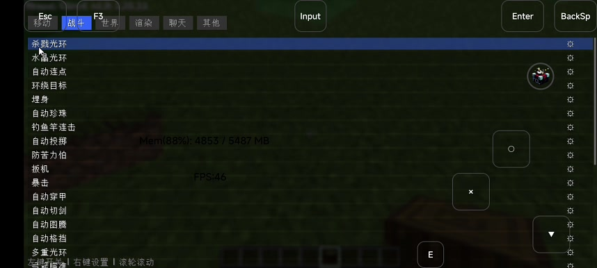
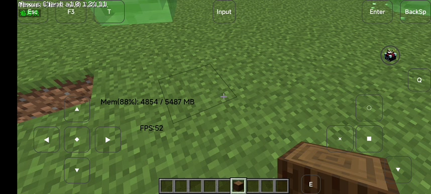
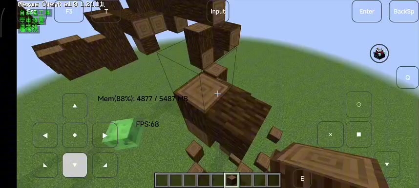
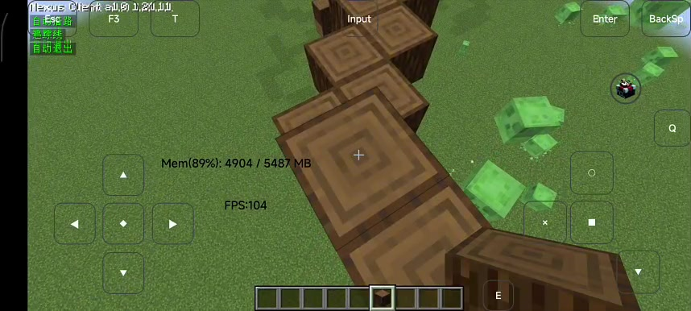

# Nexus

Nexus Fabric Client，个人自制的 Minecraft 客户端。

## 版本
- Minecraft: 1.21.11
- 当前版本: a0.6

## UI 预览

### ClickGUI 功能列表


### 游戏内 HUD


### ESP 与自动挖掘


### 建筑演示


## 编译
环境要求：JDK 21

```bash
# 克隆仓库
git clone https://github.com/911q2w3e1q/Nexus.git
cd Nexus

# 编译
./gradlew build
```

编译好的 jar 会在 `build/libs/` 目录下。

## 下载
去 [Releases](https://github.com/911q2w3e1q/Nexus/releases) 页面下载对应版本的 jar 文件。

## 致谢

特别感谢 [doubao](https://www.doubao.com/) 在项目开发、代码重构、文档编写和发布流程优化中的大力支持。

## License
本项目基于 **MIT License** 协议开源。

## 免责声明
本项目仅用于编程学习与研究。
在公共服务器使用本客户端，大概率违反服务器规则，会导致账号封禁，一切后果由使用者自行承担。
